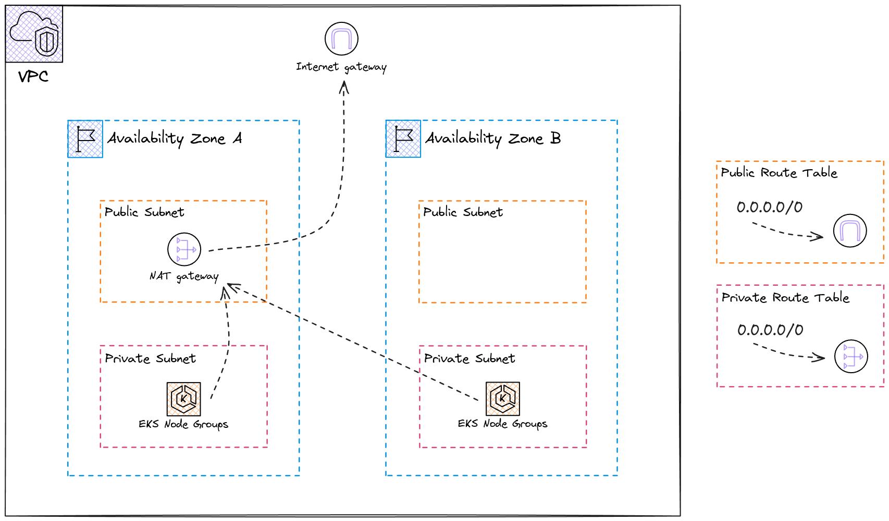

# Cloud Infrastructure Architecture

## Overview

This architecture provides a highly available, multi-AZ VPC for AWS EKS, ensuring resilient and scalable workloads. Implementation based on [this AWS Architecture Blog Field Notes](https://aws.amazon.com/blogs/architecture/field-notes-managing-an-amazon-eks-cluster-using-aws-cdk-and-cloud-resource-property-manager/) and [Anton Putra's Crossplane Tutorial](https://www.youtube.com/watch?v=mpfqPXfX6mg).

## Core Components

- **VPC** - Provides an isolated network environment in AWS with an attached Internet Gateway (IGW) for external communications.

- **Multi-AZ Design** - Leverages two Availability Zones for fault tolerance. If one AZ experiences issues, applications continue running on the other, significantly improving overall availability.

- **Network Segmentation** - Each AZ contains public and private subnets. Public subnets route directly to the IGW and host a NAT Gateway in one AZ for managed outbound connectivity. Private subnets contain EKS Node Groups without direct internet access, enhancing security by preventing direct exposure of workloads.

- **Traffic Flow** - Route tables control traffic differently per subnet type. Public route tables direct traffic to the IGW for direct internet access. Private route tables route outbound traffic through the NAT Gateway, allowing private resources to pull updates and container images without being directly accessible from the internet.

- **Kubernetes Layer** - EKS Node Groups in private subnets run containerized applications and communicate across AZs while pulling images and making API calls through the NAT Gateway. The architecture supports two node types: on-demand instances for guaranteed availability and consistent performance, and spot instances for cost-effective compute with potential interruptions. Prioritizing spot instances can reduce costs by 60-80%.
