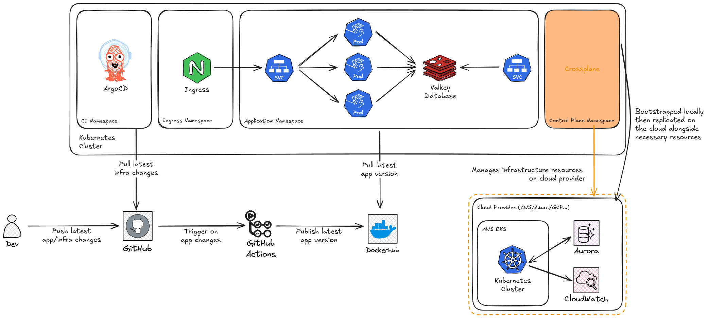

# Infrastructure Architecture

## Overview

This infrastructure provides a cloud-agnostic, GitOps-driven approach to building scalable and resilient systems. It combines local Kubernetes development with automated cloud provisioning using ArgoCD and Crossplane, enabling consistent infrastructure management across any cloud provider.

## Core Components

### Local Development Clusters

Lightweight Kubernetes clusters running on developer workstations that mirror production infrastructure. These clusters provide a complete development and testing environment with quick feedback loops, allowing infrastructure validation before committing changes to the GitOps workflow.

### GitOps Repository

A centralized Git repository containing all infrastructure definitions, application manifests, and configuration files. This serves as the single source of truth for the system's state, providing clear visibility of infrastructure evolution through standard Git workflows.

### ArgoCD

The GitOps operator responsible for monitoring the Git repository and ensuring continuous synchronization between the desired state in Git and the actual state of both local and cloud environments. The architecture uses two distinct ArgoCD applications:
- One for application workloads and configurations
- Another for infrastructure resources and lifecycle management

### Crossplane

The cloud-agnostic infrastructure provisioning engine that translates Kubernetes Custom Resource Definitions (CRDs) into actual cloud resources. It provides a standardized abstraction layer that decouples infrastructure definitions from specific cloud provider implementations, enabling seamless provider switching through configuration changes.

## Architecture Design

### Dual-Cluster System

**Local Development Cluster**

- Primary workspace for infrastructure development and testing
- Uses local substitutes for cloud services (databases, storage)
- Can be managed on-demand (created, deleted, updated) without impacting deployed resources
- Provides developers with autonomy and fast feedback for testing infrastructure changes

**Cloud Deployment Cluster**

- Responsible for creating and managing production infrastructure on the chosen cloud provider
- Process begins with Crossplane provisioning necessary cloud infrastructure, including the Kubernetes cluster
- Once infrastructure is established, ArgoCD is automatically installed, enabling the system to become self-managed
- Operates independently of local development infrastructure

### Resource Management

The primary difference between local and cloud environments lies in their resource overlays and provider configurations:

- **Local cluster**: Uses local substitutes for services like databases and storage
- **Cloud cluster**: Utilizes managed cloud services provisioned by Crossplane

## Operational Model

### Infrastructure Provisioning Workflow

1. **Development Phase**: Infrastructure definitions are developed and tested in local clusters
2. **Git Integration**: Infrastructure changes are committed to the GitOps repository
3. **Automated Deployment**: ArgoCD instances monitor the repository and apply changes
4. **Cloud Provisioning**: Crossplane provisions cloud infrastructure based on definitions
5. **Self-Management**: Cloud cluster becomes autonomous via ArgoCD installation

### Continuous Infrastructure Management

ArgoCD instances in both environments constantly monitor the shared Git repository, identifying changes to infrastructure definitions in real-time. When changes are committed:

- Both local and cloud ArgoCD instances independently assess and apply necessary updates
- Environment-specific overlays ensure correct configurations for each target
- Local cluster provides rapid feedback for infrastructure iteration
- Cloud cluster applies changes using production-configured resources

### Resilience and Independence

The cloud cluster's self-managed nature provides significant operational benefits:

- Once ArgoCD is active in the cloud, it operates independently of local development infrastructure
- If local clusters go offline or are deleted, cloud resources continue running and stay synchronized with Git
- Developers can connect to existing cloud resources from new local environments without interrupting production workloads
